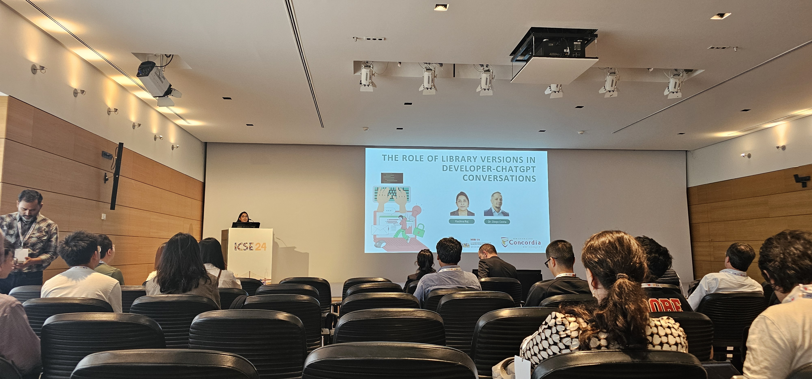

Rachna presented her work on ["The role of library versions in Developer-ChatGPT conversations"](https://dl.acm.org/doi/10.1145/3643991.3645075), a MSR Data Mining Challenge study that investigated whether developers refer to library versions when asking ChatGPT for code recommendations. Spoiler alert: they do not, at least not as often as we expected. And when they use library versions in their conversation, they use it in the hopes of receiving tailored code recommendations or to troubleshoot issues with their code.

For her outstanding presentation, Rachna was awarded the best student presentation award at the 2024th edition of the Mining Software Repositories (MSR) conference. Way to go, Rachna!

