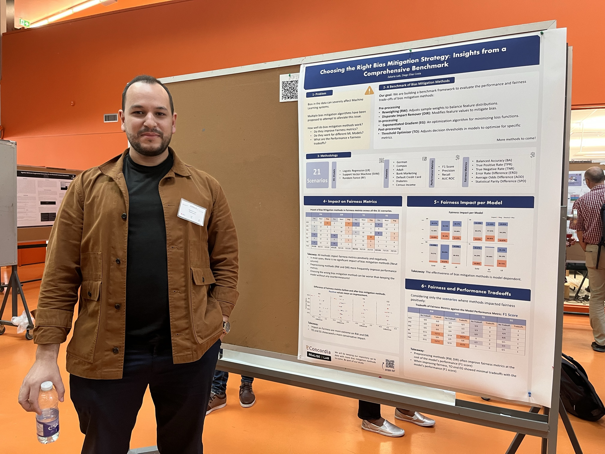

Zakaria has presented his work in progress entitled "Choosing the Right Bias Mitigation Strategy: Insights from a Comprehensive Benchmark." In this work, we conduct an experimental assessment of bias mitigation methods over 21 scenarios, considering different machine learning models and datasets. 

Our goal is to set a large benchmarking framework to help practitioners choose the right bias mitigation strategy for their specific use case. The poster was presented at the 2024th edition of the Software Engineering for Machine Learning Applications (SEMLA).

