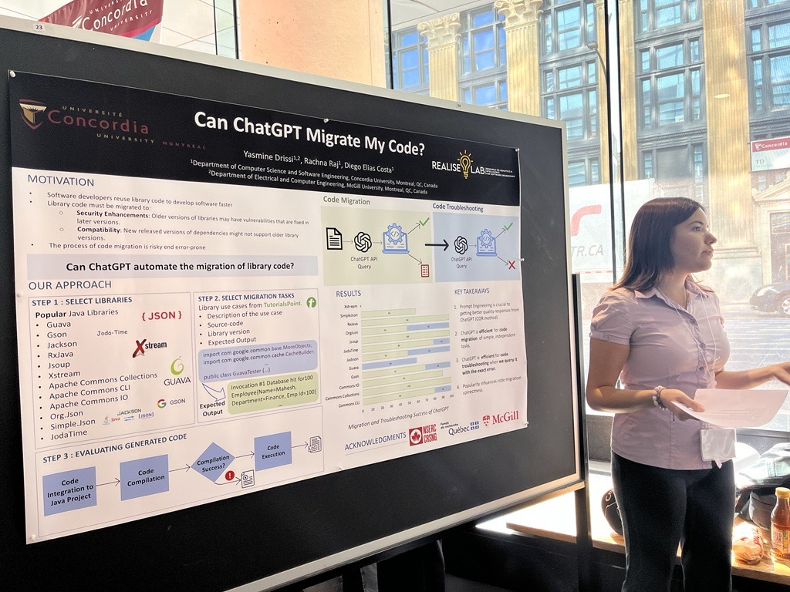
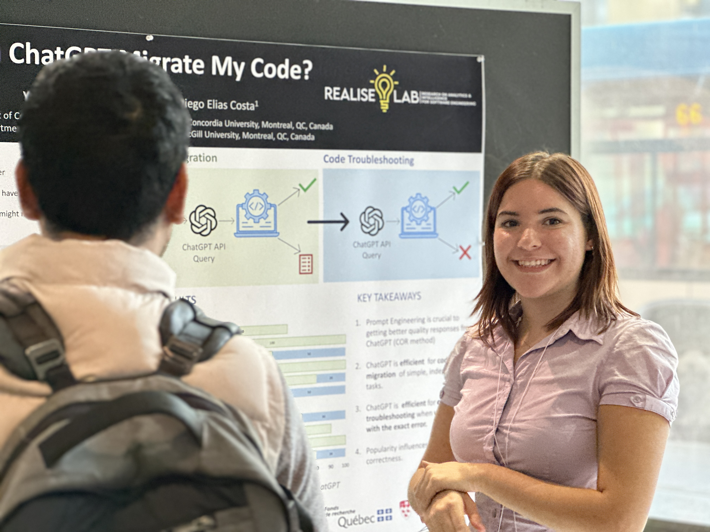

Yasmine presented her summer internship work at the Undergraduate Research Showcase at Concordia University. Her work entitled "Can ChatGPT Migrate My Code" explores the idea of using ChatGPT for migrating code that uses third-party libraries. The experiment consisted in prompting ChatGPT to migrate the code of one library version to another, and evaluating whether the generated code was correct. And the results were promising, with ChatGPT achieving a much higher degree of success than we originally anticipated.

The poster presentation was a great success, way to go Yasmine! If you are interested in the details of this project, keep an eye out as we are preparing a paper submission soon. 

