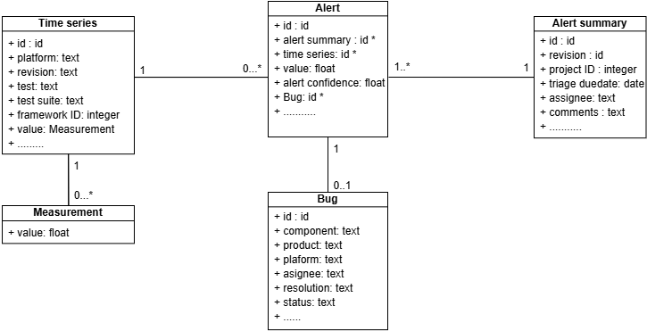

import CSVTable from "@site/src/components/CSVTable";

### What is the paper about?

Performance regressions in software systems can lead to significant financial losses and degraded user satisfaction, making their early detection and mitigation critical. 

One of the major issues encountered in both the academic and industrial landscapes is access to data from the industry, and this issue prevales in performance engineering as such datasets contain information about a company's internal systems. To address this gap, we introduce a unique dataset to support various research studies in performance engineering, anomaly detection, and machine learning. 

This paper introduces a **unique dataset** of performance measurements and alerts from Mozilla, aimed at advancing research in performance engineering and anomaly detection.  
Collected from Mozilla Firefox’s testing systems, this dataset contains:  
- **5,655 time series**  
- **17,989 performance alerts**  
- **Mozilla Engineers-validated annotations** spanning **May 2023 – May 2024**  

<!--truncate-->
---

By making this dataset publicly available [here](https://doi.org/10.5281/zenodo.14642238), we hope to support researchers working on:  
- **Performance characterization**  
- **Regression prediction**  
- **Bug analysis**
- **Root cause investigation**  

Feel fre to check the paper pre-print [here](https://arxiv.org/abs/2503.16332).

### What Is the Context of the Dataset?

As new code is pushed to Mozilla's codebase, multiple performance tests are executed on periodic basis to assess the performance of the new code. For example, we noticed that their testing repository, called [Autoland](https://hg.mozilla.org/integration/autoland/), have a test execution periodicity of 4 hours.
For each code [revision](https://wiki.mercurial-scm.org/Revision) (commit) under test, performance tests run on various environments (referred to as 'platforms' in Mozilla's context). 
The result of a single performance test is a **performance measurement**, which can represent execution time, memory consumption, and other tested performance characteristics.   

Given the inherent variability of software performance, performance tests could be repeated multiple times to increase the robustness of the results, a common practice in software performance engineering.
Therefore, a performance time series is a sequence of performance measurements of the same performance test on a single platform throughout multiple revisions, and is commonly identified as a signature in Mozilla's terminology. 

Mozilla's performance anomaly detection system is called [Perfherder](https://treeherder.mozilla.org/perfherder/alerts?hideDwnToInv=1&page=1), and it is developed to identify performance anomalies that need further investigation. 
Mozilla's Perfherder periodically runs performance checks by analyzing one of the recent revisions by computing its T-test score from the two-sample [student T-test](http://jstor.org/stable/2331554) to contrast the measurements of generally 12 preceding revisions minimum that had performance measurements with the current plus a maximum of 11 subsequent ones.
The resulting T-value is used as a confidence score showcasing the likelihood of the occurrence of a performance anomaly.
In case the T-test shows a significant change detected by comparing it to a fixed threshold, Perfherder proceeds with measuring the change magnitude between both measurement groups, and if it surpasses a certain threshold, an alert is triggered on Perfherder.

Alerts related to the same software revision are grouped in an **alert summary**. These alert summaries are then manually evaluated by a [Performance Sheriff](https://firefox-source-docs.mozilla.org/testing/perfdocs/perf-sheriffing.html), a member of Mozilla's performance team, who assesses whether the alert should be further investigated. 
Performance Sheriffs can also create new alerts manually, if they notice a performance anomaly that was missed by Perfherder. 
In case the investigated alert summary presents an actual regression, a bug is created and associated with the given alert summary.

### What Does the Dataset Contain? 

The dataset contains a folder containing the performance time series data, alerts and alerts summaries, and bugs. Performance time series are further organized into their respective repositories, and we store a single CSV per performance time series. Alerts and bugs, on the other hand, are stored on one CSV file each.  

The following is a sample of the alerts:  

<CSVTable filePath="https://realiselab.github.io/other/alerts_data.csv" />

The following is a sample of the bugs:

<CSVTable filePath="https://realiselab.github.io/other/bugs_data.csv" />

The following is a sample of the timeseries:  

<CSVTable filePath="https://realiselab.github.io/other/sample_timeseries_data.csv" />

### Where will we present it?

We will present this work at **ICPE 2025**, which will take place at **York University in Toronto, from May 5th to May 9th, 2025**.  