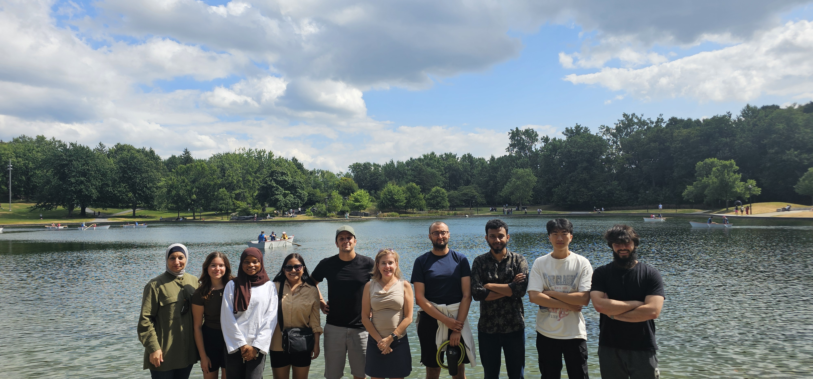
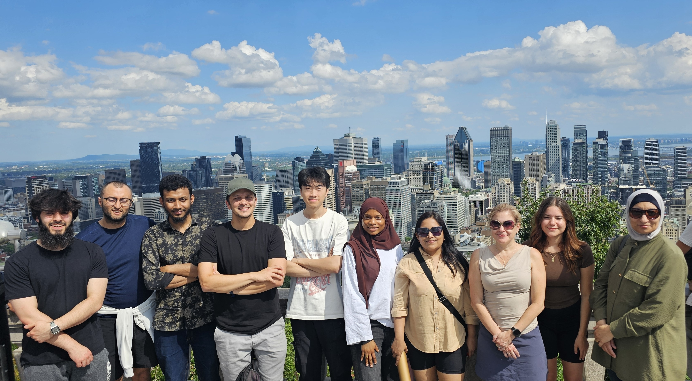

As winter is approaching by the hour, Montréalers, including ourselves, are making most of summertime while possible. Therefore, for a brief summmer afternoon, we turn off the Overleaf and Google colab tabs (but not our laptops because the 'experiment is running', it is always the case) and head out for a sunshine hunt hike, and since Concordia is in downtown, there is no better option than to do the hike in Mont Royal, the iconic landmark of the island. This hike became our yearly ritual. We started the hike with a convinient lunch of Kebab sandwiches in the Chalet across Beaver lake. Before proceeding to the summit, we had to get that Beaver lake picture and it couldn't look any better.

We continued the hike towards the summit to take the iconic view of the Montréal skyline. After too much effort to claim some space among the touristic crowds, we were able to capture the picture.

We wraped the hike with a Freesbe game under the shadows of the mountain trees.
This hike was the opportunity to show our interns, especially our (relatively) new international Mitacs interns, how beautiful Montréal is. Also, at the end of the hike, we said our farewell to our beloved [Haya](https://ps.linkedin.com/in/haya-samaana) and wished to her a safe trip back to Palestine.