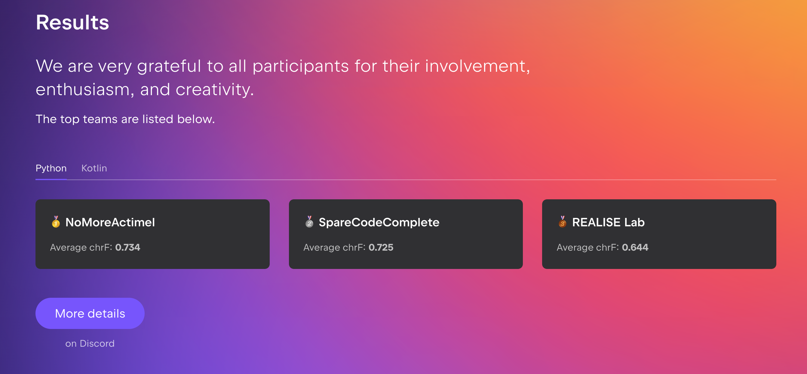

We are happy to announce that our paper "Beyond More Context: How Granularity and Order Drive Code Completion Quality" was accepted in the Context Competition Challenge Workshop, colocated with ASE 2025. 
This work was authored by Uswat Yusuf during her internship at RealiseLab last summer.

The competition challenged participants to develop strategies for gathering code context to maximize the performance of code completion models, based on a baseline provided by JetBrains. 
Our team achieved third place in the competition! We experimented with file chunking and chunk ordering on both Python and Kotlin source files, and found that chunk-level retrieval outperforms file-level retrieval. 
- Also, ordering is important: ordering the chunks in reverse order yielded measurable gains, supporting the recency bias.

:::info
Interested? You can find a pre-print of our paper [here](https://arxiv.org/abs/2510.06606). 
:::

