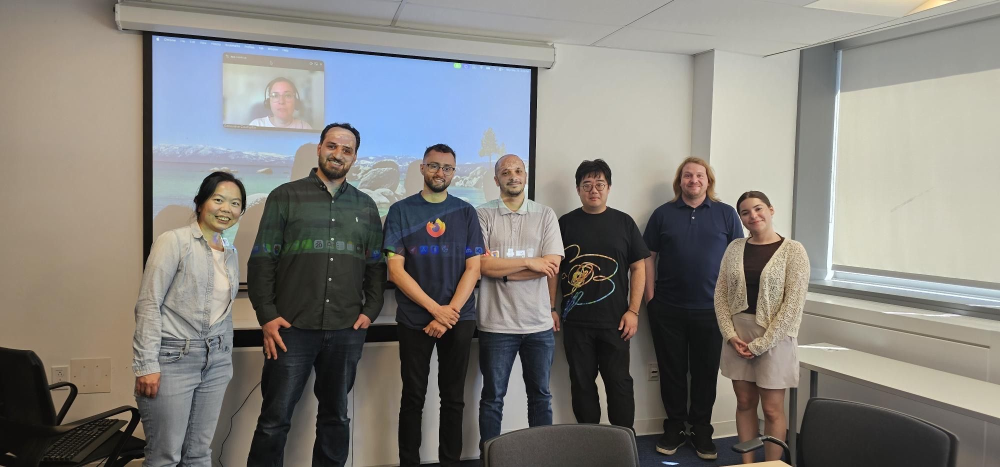

Congratulations to Mohamed Bilel Besbes, who successfully defended his Master of Applied Science (Software Engineering) thesis! 
I am really proud of how far Bilel has gone as a researcher, and his thesis has been graded as outstanding for his impactful work on software performance testing.

<!--truncate-->

Bilel's thesis tackles a real-world challenge at Mozilla, whose performance engineering management system (Perfherder) relies on a Student's T-test-based approach to flag performance regressions across hundreds of daily code changes. A preliminary analysis of one year of Mozilla performance data revealed that at least 12.47% of generated alert groups are false positives, while roughly 6.8% contain regressions that the automated system misses.

To explore better alternatives, Bilel conducted a large-scale empirical study evaluating 25 change point detection (CPD) methods spanning offline, online, and hybrid approaches, along with 15 ensemble strategies. He constructed a ground-truth dataset of 174 performance time series manually annotated by eleven Mozilla performance engineers, one of the first large-scale, practitioner-annotated CPD benchmarks for performance engineering, and extended the *TCPDBench* evaluation tool with previously unrepresented method families. His results show that ensemble voting strategies can surpass Mozilla's current method, with an offline ensemble reaching an F1-score of 78.4% over the 70.6% baseline.

A huge thank you to Dr. Peter Chen and Dr. Shin Hwei Tan for composing the evaluation committee for Bilel's thesis defence.

Congratulations, Bilel, and best of luck on your next adventure!
