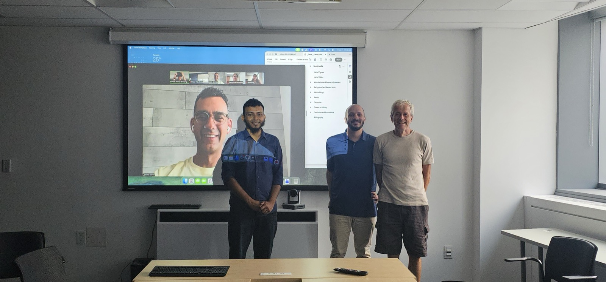
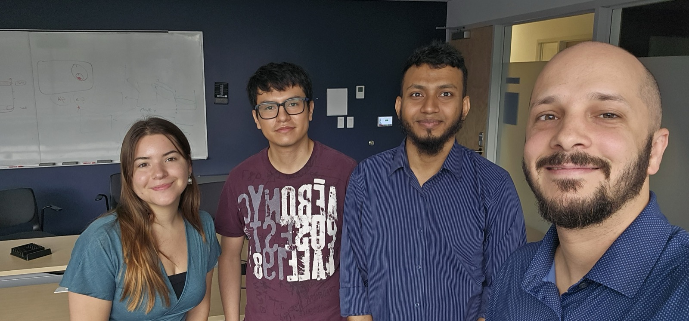

Congratulations to Kawsar Ahmed Bhuiyan, who successfully defended his Master of Applied Science (Software Engineering) thesis
"Beyond Compliance: A Large Scale Study on the Completeness and Consistency of the GitHub SBOMs"!
It has been a pleasure to see Kawsar grow as a researcher, tackling a topic that sits right at the heart of software supply chain security.

<!--truncate-->

In his thesis, Kawsar presents a large-scale analysis of 10,000 GitHub repositories across ten programming language ecosystems, evaluating GitHub SBOMs against three other popular SBOM generators: *Syft*, *Trivy*, and the *Microsoft SBOM Tool*. His study finds a lack of NTIA compliance in GitHub SBOMs, though core metadata is consistently present. He also finds that the availability of component version and license information depends heavily on the programming ecosystem. Compared with the other three tools, GitHub yields results similar to the Microsoft SBOM Tool, and often outperforms Syft and Trivy in providing version and license information. Kawsar closes by discussing potential shortcomings of the GitHub SBOM tool, directly related to how each ecosystem manages its dependencies.

A huge thank you to Dr. Emad Shihab and Dr. Juergen Rilling for composing the evaluation committee for Kawsar's thesis defence.

Congratulations, Kawsar, and best of luck on your next adventure!
