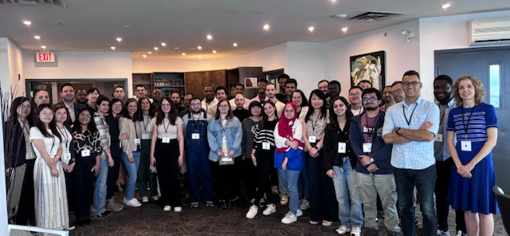
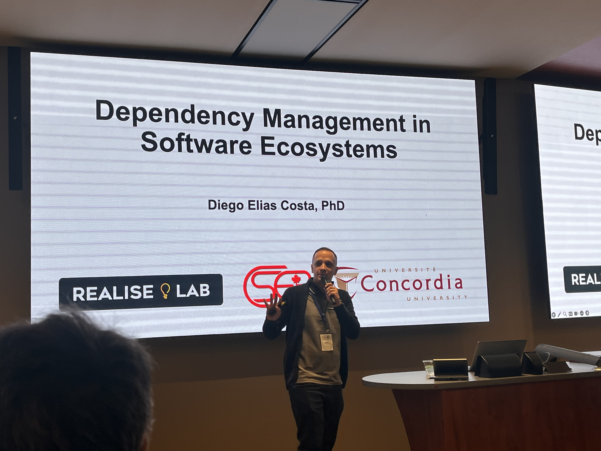

The REALISE Lab had an amazing experience at the CREATE SE4AI retreat in Kingston this July 2024. The CREATE SE4AI is a training initiative focused on the development, deployment, and servicing of artificial intelligence-based software systems. The retreat provided us with a wonderful opportunity to connect with researchers and professors from the program, sharing our research ideas and experiences in person. We spent a day and night at the scenic Delta Inn hotel surrounded by beautiful landscapes. The retreat was highlighted by engaging presentations from students, including Rachna from our lab, who shared her work on her recently published paper at MSR 2024. The evening was capped off with a delightful dinner and a charming walk through the streets of Kingston, a town full of natural beauty and perfect for relaxation.

Following the retreat, we participated in the first day of the Canadian Software Engineering Research (CSER) conference. This event brought together renowned researchers in the field of software engineering. We gained new insights and perspectives from the talks, particularly those from young professors, which were both inspiring and informative. Prof. Costa's presentation on Dependency Management offered valuable insights into a critical area of our work. The conference provided us with valuable opportunities to network, learn, and collaborate with fellow researchers.
The CREATE SE4AI retreat and CSER conference were memorable and enriching experiences for the REALISE Lab. They offered us the chance to connect with the broader research community, learn from leading experts, and showcase our work.

