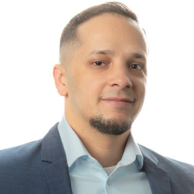

## Diego Elias Damasceno Costa

Hi, I am an Assistant Professor in the [Computer Science and Software Engineering (CSSE)](https://www.concordia.ca/ginacody/computer-science-software-eng.html) department of [Concordia University](https://www.concordia.ca/)
Before, I worked as an Assistant Professor with the Computer Science department at [UQAM](https://www.uqam.ca) in Montréal, Canada. I was a postdoctoral researcher at [Concordia University](https://www.concordia.ca/), Canada, working with Prof. [Emad Shihab](https://das.encs.concordia.ca/members/emad-shihab/). I received my PhD from Heidelberg University, Germany in the [Parallel and Distributed Systems Group](https://pvs.ifi.uni-heidelberg.de/home/) of [Prof. Andrzejak](https://pvs.ifi.uni-heidelberg.de/team/aa/). 

I am interested in Software Engineering Research. In a few words, I want to reduce the burden on software developers by tackling aspects related to **software maintenance** and **software performance**. 
I like to leverage historical project data (e.g., GitHub) through Data Mining methods and apply Machine Learning and Statistical Analysis techniques to understand the problems developers face and provide insights/solutions to alleviate the issues. 

For details about my research, please check the REALISE [publication list](/publications/).

### Research Interests

- Software Engineering
- Performance Engineering
- Software Ecosystems
- Mining Software Repositories
- Software Development Bots

### Teaching

Teaching courses:
- COMP 352: Data Structures and Algorithms  *fall 2023* 
- SOEN 692: Generative Artificial Intelligence for Software Engineering  *winter 2024* 
- COMP 352: Data Structures and Algorithms  *fall 2023* 
- [MGL 7811: Ingénierie des systèmes d’IAntelligence artificielle](https://github.com/create-se4ai/engineering-ai-systems-course/tree/mgl7811-winter-2023)  *winter 2023* 
- [SOEN 691: Engineering AI-based software systems](https://github.com/create-se4ai/engineering-ai-systems-course) *winter 2022* 

### Grants and Awards

- [FRQNT Support for New Academics Grant](https://frq.gouv.qc.ca/en/program/research-support-for-new-academics-frqnt/) (2024-25)
- [NSERC DISCOVERY Grant](https://www.nserc-crsng.gc.ca/professors-professeurs/grants-subs/dgigp-psigp_eng.asp) (2023-27) 
- [NSERC CREATE SE4AI](https://se4ai.org) (2022-27)
- [Horizon Postdoctoral Fellowship](https://www.concordia.ca/sgs/postdoctoral-fellows/funding/horizon.html) (2019-21)  
- [Heidelberg Graduate School MathComp Scholarship](https://www.mathcomp.uni-heidelberg.de/) (2015-17) 

### Contact
- [Twitter](#)
- [LinkedIn](#)

<!--  -->
