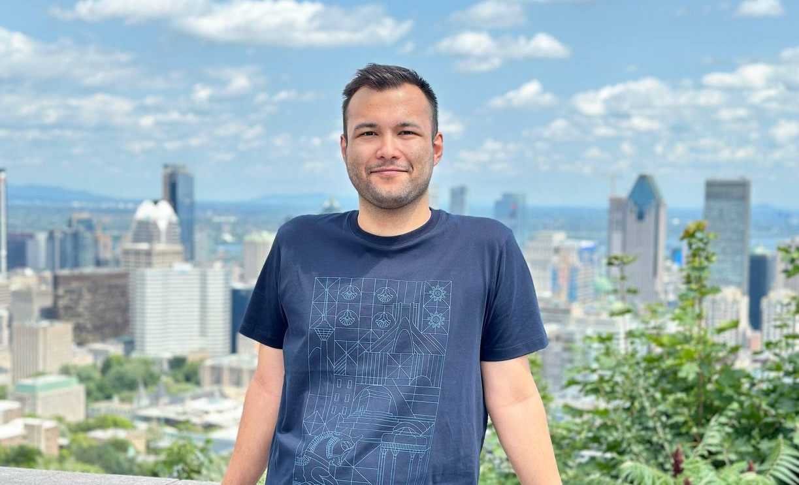

## Matin Koohjani

My name is Matin Koohjani. I am a passionate and dedicated software engineer student with over 4 years of industry experience. As a member of the REALISE Lab at Concordia University, I thrive on doing research on different SE areas.

## Academic experience

- Software Engineering M.A.Sc at [Concordia University](https://www.concordia.ca/) (<em>May 2024 - Present</em>)
- Research Intern at [KimiaLab/Waterloo](https://tizhoosh.com/labs/kimia-lab/) (<em>April 2023 - July 2023</em>)
- Computer Science B.Sc [Ferdowsi University of Mashhad](https://um.ac.ir/) (<em>Sep 2018 - July 2023</em>)

## Professional experience
- Software Engineer - Backend [NeshanMaps](https://neshan.org/) (<em>Jul 2020 - April 2024</em>)

### Contact
- [LinkedIn](#)

