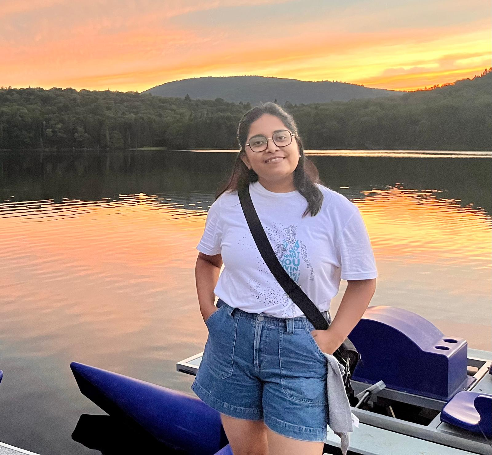

## Rachna Raj

I'm a PhD student in Software Engineering. Before returning to school, I spent around five years as a software developer at Infosys and IBM India Software Labs. I'm driven to create solutions that automate boring, repetitive tasks for software developers so they can focus on the fun stuff—building awesome software for everyone! Right now, I'm focusing on dependency management and working on developing a tool to support library developers.

### Why Research ?
> I'm passionate about research because it lets me explore and solve problems that will benefit software development processes. PhD allows me to question and reason things and as Albert Einstein once said, "The important thing is not to stop questioning. Curiosity has its own reason for existing." I aim to stay in academia and contribute to Software Engineering by bridging the gap between research and real-world applications.

### Education
- Software Engineering PhD at [Concordia University](https://www.concordia.ca/) (Fast-Tracked) (<em>Sept 2024-Present</em>)
- Software Engineering masters at [Concordia University](https://www.concordia.ca/) (<em>Sept 2023-Present</em>)
- BTech in Computer Science & Engineering Program at [NERIST, India](https://nerist.ac.in/) (<em>July 2015 - July 2019</em>)

### Publications
- The role of library versions in Developer-ChatGPT conversations [MSR 2024](https://dl.acm.org/doi/10.1145/3643991.3645075)
- Towards Supporting Open Source Library Maintainers with Community-Based Analytics [ICSE 2026] (https://arxiv.org/pdf/2510.15794)

### Professional Experience
- Junior PC MSR 2026 (Technical Track)
- Web chair for BoatSE 2026 (https://botse.github.io/)
- Member of CREATE SE4AI(https://se4ai.org/) group at Concordia University specially crafted to produce highly qualified   
 software engineers to tackle development problems of AI applications.
- Supervising interns at REALISE Lab.
- Teaching Assistant at Concordia University.
- Software Developer at [IBM ISL](https://www.ibm.com/in-en/) (<em> 2022 - 2023 </em>)
- Senior Systems Engineer at [Infosys Research Labs, India ](https://www.infosys.com/insights/ai-automation/adaptive-systems.html) (<em>2019 - 2022</em>)
- Graduate Engineer at [Vedanta Resources](https://www.vedantaresources.com/) (<em> June 2019 - July 2019</em>)
- Software Developer Intern at [ISRO, India](https://www.isro.gov.in/NESAC.html) 
- Software Developer Intern at [DRDO, India](https://www.drdo.gov.in/drdo/labs-and-establishments/defence-scientific-information-documentation-centre-desidoc)

### Certifications
- [Azure AZ-900 Certification](https://www.credly.com/badges/329bc7fb-77fb-430b-9e5a-46be95dc7931?source=linked_in_profile)

### Awards
- Best Student Presentation Award at MSR 2024, Lisbon Portugal.
- Infosys Rise Awards for recognizable contributions and effort in the development of a healthcare solution.
  Infosys Insta Awards for exploring potential solutions for a problem with an accepted PoC.
- Gold Medalist, BTech, scoring highest in the batch.
- Recognised by the governor of Arunachal Pradesh for contributing to women's education and hygiene in the local community.

### Research Interests

I am passionate about working on the topic of Software Maintenance, particularly in supporting open-source library developers and maintainers, exploring and enhancing Software Bills of Materials, and handling breaking changes. My career goal is to conduct cutting-edge research in software engineering and artificial intelligence, supporting the AI applications development lifecycle (SE4AI). I aim to explore innovative methods to harness AI (applied AI) in software engineering (AI4SE) to create technically advanced applications. As I progress in my academic journey, I also aspire to engage in EDI (Equity, Diversity, and Inclusion) within Software Engineering research, contributing to a safer and more inclusive future. Though these goals are ambitious, they inspire me to aim high!

### Contact
You can reach me at:
- [LinkedIn](https://www.linkedin.com/in/rachna-raj/)
- [Twitter](https://twitter.com/R_Rachna1508/)

